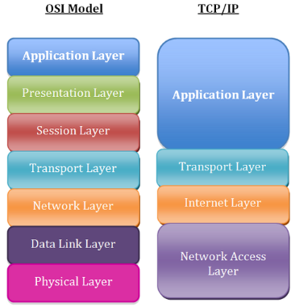

# Ghi chú môn học lập trình mạng

## Chương 1

### 1. Các khái niệm cơ bản
- Địa chỉ IP: gồm địa chỉ `private` (nội bộ, dùng trong LAN) và `public` (dùng chung trên internet)
- Địa chỉ mạng và broadcast:
  + Một địa chỉ IP (IPv4) sẽ có 32 bit
  + Subnet mask cũng 32 bit và dùng để phân chia phần network và phần host (vd 255.255.255.0/24 => 24 bit net và 8 bit hos, Host Range: 192.168.1.1 đến 192.168.1.254)
  + `Network Address` (bit host = 0) là địa chỉ đại diện cho cả subnet, dùng để định danh subnet
  + `Broadcast Address` (bit host = 1) là địa chỉ dùng để gửi data đến tất cả các host trong cùng subnet

### 2. Mô hình mạng và tầng giao thức
#### 2.1 Mô hình mạng

#### 2.2 Các giao thức phổ biến
- Tầng liên kết mạng: Ethernet, Wi-Fi, ARP
- Tầng internet: IP (IPv4, IPv6), ICMP(ping)
- Tầng transport:
  + `TCP`: kết nối tin cậy, có kiểm soát (dùng cho web, gmail)
  + `UDP`: không tin cậy, nhanh (dùng cho video, game)
- Tầng ứng dụng:
  + Web: HTTP, HTTPS
  + Mail: SMTP, POP3, IMAP
  + File: FTP, SFTP, TFTP
  + Tên miền: DNS
  + Remote login: SSH, Telnet

## Mail Server
- Cách cài đặt một mail server cơ bản:
  + Hướng dẫn trong bộ cài đặt của Window Server
  + Dùng phần mềm của bên thứ 3: `AspEmail`, `Mercury`, `Pegasus`   

