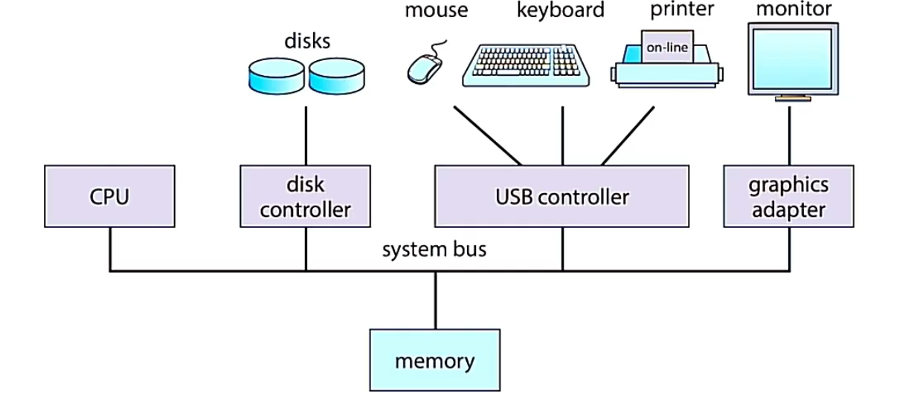

d# Chương 1: 
## 1. Tổng quan về hệ điều hành
- Hệ điều hành là **chương trình** trung gian nằm giữa người sử dụng và phần cứng máy tính, giúp người dùng tương tác với các ứng dụng rồi các ứng dụng sẽ tương tác với phần cứng thông qua hệ điều hành
  + Phần cứng (hardware): Là các tài nguyên cơ bản của máy tính như CPU, bộ nhớ, thiết bị I/O (còn có Microprograming và machine language)
  + Hệ điều hành là 1 phần của system programs
- Chức năng:
  + Quản lý và cấp phát tài nguyên một cách hiệu quả
  + Giúp người dùng dễ sử dụng hệ thống (cung cấp giao diện cho người dùng)
  + Là nơi để người dùng cài đặt các chương trình ứng dụng
  + Kết nối các thiết bị phần cứng với nhau
  
- User -> Application programs -> System programs -> Computer hardware
  + User không chỉ là người mà cũng có thể là machines, other computers

## 2. Hoạt động bên trong máy tính
- Bên trong hệ điều hành:
  + Tồn tại một chương trình luôn chạy tại tất cả thời điểm khi máy tính hoạt động được gọi là nhân/ hạt nhân (kernel)
  + Tồn tại thêm 2 loại chương trình 
    - Chương trình hệ thống: được đóng gói đi cùng với hệ điều hành nhưng không phải là 1 phần của nhân
    - Chương trình ứng dụng: tất cả các chương trình không có associate với hoạt dộng hệ thống
  + Ngày nay thì có thêm 1 số hệ điều hành có chứa middleware
- Một máy tính hiện nay là gồm CPU (1 hoặc nhiều) và device controller kết nối với nhau thông system bus để truy xuất shared memory

- Các thiết bị I/O và CPU có thể thực thi đồng thời (concurrently)
- Mỗi device controller chịu trách nhiệm một loại thiết bị cụ thể
- Mỗi device controller có một bộ đệm cục bộ (buffer local)
- CPU di chuyển dữ liệu giữa bộ nhớ chính và các bộ đệm cục bộ
- Khi device controller hoàn tất các thao tác, nó báo hiệu cho CPU bằng cách phát sinh 1 ngắt (interrupt)

### 2.1 Ngắt
- Đặt điểm cơ bản của ngắt
  + Ngắt chuyển quyền điều khiển đến interrupt service routine thông qua interrupt vector (chứa địa chỉ của tất cả service routine)
  + Kiến trúc ngắt phải lưu địa chỉ của lệnh phát sinh ngắt
  + Ngắt được tạo ra do 1 phần mềm lỗi hay do yêu cầu của người dùng thì gọi là trap hoặc exception
  + Hệ điều hành hoạt đôngj đinh hướng theo ngắt
- Quá trình phát sinh và xử lý ngắt
  + CPU có 2 trạng thái là user program và I/O interrupt processing
  + I/O device có 2 trạng thái là idle và transferring
- Quy trình xử lý ngắt
  + Hệ điều hành lưu giữ trạng thái của CPU bằng cách lưu thanh ghi và bộ đếm chương trình
  + Xác định loại ngắt đã xảy ra -> đi đến bảng vector ngắt và gọi ra hàm ngắt tương ứng -> thực thi mã xử lý tương ứng với từng loại ngắt

### 2.2 Cấu trúc lưu trữ
- Hệ thống lưu trữ được phân cấp dựa trên:
  + Tốc độ truy xuất (speed)
  + Chi phí (cost)
  + Khả năng lưu trữ dữ liệu khi không có nguồn điện (volatility)

#### (1) 
  + Bộ nhớ bay hơi -> bay hơi khi ko có nguồn điện -> được phân cấp là primary storage
  + Bộ nhớ không bay hơi
 
#### (2)
  + Gồm đĩa quang và băng từ đây là loại bộ nhớ có thể lấy ra khỏi máy tính
- Bộ nhớ chính - thiết bị lưu trữ dung lượng lớn duy nhất mà CPU truy xuất trực tiếp
  + Truy xuất ngẫu nhiên
  + Mất dữ liệu khi không có nguồn điện
  + Được xây dựng trên công nghệ bán dẫn Dynamic Random-access Memory (DRAM)
- Bộ nhớ thứ cấp (secondary storage) - mở rộng cho bộ nhớ chính để cung cấp khả năng lưu trữ không bay hơi dung lượng lớn

### 2.3 Cấu trúc nhập/xuất

## 3. Kiến trúc hệ thống máy tính
- Hệ thống đơn bộ xử lý
- Hệ thống đa bộ xử lý
- Hệ thống gom cụm

### Phân biệt các khái niệm
- CPU (Central Processor Unit) - Thành phần phần cứng thực thi các lệnh
- Processor (bộ nhớ chính) - Một con chip chứa một hoặc nhiều CPU
- Core (lõi/nhân) - Đơn vị tính toán cơ bản của CPU
- Multicore (đa lõi) - Nhiều lõi tính toán trên cùng một CPU
- Multiprocessor (đa bộ xử lý) - Nhiều bộ xử lý

## 3.1 Hệ thống đơn bộ xử lý
- Chỉ có 1 bộ xử lý đa dụng và 1 lõi duy nhất
- (Có thể kèm theo bộ xử lý riêng biệt)

## 3.2 Hệ thống đa bộ xử lý
- Ưu điểm
  + Tăng cường năng suất hệ thống (Vì càng nhiều bộ xử lý thì nhanh xong việc)
  + Kinh tế (Vì các bộ xử lý có thể dùng chung tài nguyên)
  + Độ tin cậy cao (Vì khi 1 bộ xử lý hỏng thì công việc của nó sẽ được chia sẻ cho các bộ xử lý còn lại)
- Phân loại:
  + Đa xử lý bất đối xứng - Mỗi bộ xử lý thực thi công việc khác nhau

  + Đa xử lý đối xứng - Mỗi bộ xử lý cùng thực hiện tất cả các công việc
  
  
  

  + Hệ thống gom cụm - Là một hệ thống đa bộ xử lý nhưng gồm nhiều hệ thống làm việc với nhau
    - Thường thấy ở data center
    - Chia sẻ không gian lưu trữ qua `SAN` (Storage-area-network, mạng lưu trữ khu vực)
    - Cung cấp các dịch vụ có độ sẵn sàng cao
    - Có thể theo cấu trúc đối xứng hoặc bất đối xứng:
      + Gom cụm bất đối xứng: một máy ở chế độ
      +
## 4. Các thao tác trong hệ điều hành
### 4.1 Đơn chương (Monoprograming)
- Chỉ 1 công việc/chương trình được nạp vào bộ nhớ tại một thời điểm
- Công việc được thi hành tuần tự
### 4.2 Đa chương (Multiprograming)
- Nhiều công việc được nạp vào bộ nhớ -> Một công việc được chọn và chạy bởi job scheduling
- Khi chương trình phải chờ (chờ I/O..), hệ điều hành sẽ switch sang công việc khác
- Trong hệ thống đa chương, một công việc đang thực thi được gọi là một `process` (tiến trình)
- Đa chương giúp tận dụng được tgian rảnh, tăng hiệu suất CPU  
- `Multitasking` (đa nhiệm): là khả năng nhiều process chạy trong cùng một tgian (thật ra do dùng cơ chế time-sharing để luân phiên rất nhanh nên tạo cảm giác chạy đồng thời)     

---

 `Quiz kết chương`: https://docs.google.com/forms/d/e/1FAIpQLScsQUxS8ONdwNwFmtaXdnQYXh6JCmT0Af8ZBB-r6WQWfjG4-w/viewform?usp=header
