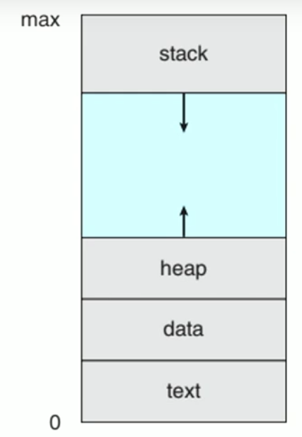
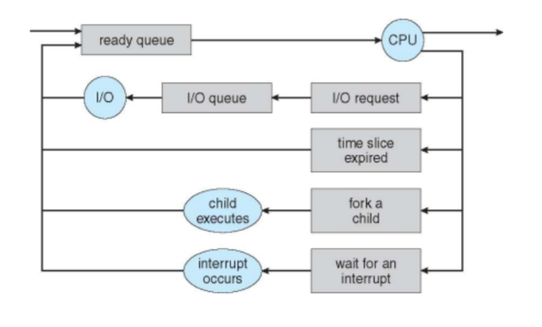
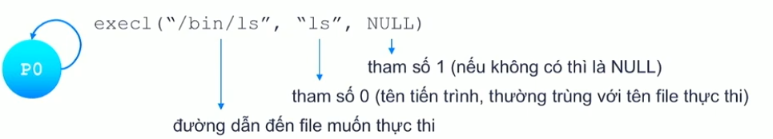

# Chương 3
## 1. Các khái niệm cơ bản
- `Chương trình` là thực thể `bị động`, nằm trong ổ cứng và không tiêu tốn tài nguyên
- `Tiến trình` là thực thể `chủ động`, nằm trong RAM và tiêu tốn các tài nguyên của máy   
- Chương trình trở thành một tiến trình khi một tập tin thực thi được nạp vào RAM 
- Không gian địa chỉ gồm:
  + `Text section`: chứa program code
  + `Data section`: chứa biến toàn cục  
  + `Heap section`: chứa bộ nhớ cấp phát động
  + `Stack section`: chứa dữ liệu tạm thời (tham số hàm, biến cục bộ, địa chỉ trả về)
    - `Địa chỉ trả về` được tạo ra trước khi hàm thực thi  

## 2. Trạng thái tiến trình
- `new`: tiến trình vừa tạo
- `ready`: tiến trình đã có đủ tài nguyên, chỉ cần chờ CPU chọn
- `running`: các lệnh của tiến trình đang được thực thi
- `waiting` or `blocked`: tiến trình đợi I/O hoàn tất,  hoặc đợi tín hiệu
- `terminated`: tiến trình đã kết thúc          

## 3. Process Control Block
- Mỗi tiến trình đều được cấp 1 PCB
- PCB gồm: 
  + Trạng thái tiến trình (`Process state`)
  + Bộ đếm chương trình (`Program counter`)
  + Các thanh ghi (`Registers`)
  + Thông tin lập thời biểu CPU 
  + Thông tin quản lý bộ nhớ (`memory limits`)
  + Thông tin lượng CPU, thời gian sử dụng 
  + Thông tin trạng thái I/O (`list of open files`)

## 4. Định thời tiến trình
- Yêu cầu hệ của điều hành về quản lý tiến trình:
  + Phân phối tài nguyên hệ thống hợp lý
  + Hỗ trợ thực thi luân phiên giữa các tiến trình
  + Cung cấp cơ chế giao tiếp và đồng bộ hoạt động các tiến trình 
- Lý do:
  + Đa chương => Tận dụng tối đa CPU
  + Time sharing (chia thời) => Tối thiểu thời gian đáp ứng
- Phần tử trong các hàng đợi định thời chính là các `PCB` của các tiến trình

### 4.1 Các hàng đợi định thời
- `Job queue`
- `Ready queue`
- `Device queues`

### 4.2 Bộ định thời
- Phân loại tiến trình:
  + Tiến trình hướng I/O
  + Tiến trình hướng CPU
- Phân loại bộ định thời:
  + `Job scheduler` hay `Long-term scheduler` ( quyết định process sẽ được nạp vào bộ nhớ chính) (cũng quyết định degree of multiprogramming)
  + `CPU scheduler` hay `Short-term scheduler` ( quyết định process nào được nhận CPU và thực thi)
  + `Medium-term scheduler` (điều chỉnh degree of multiprogramming) (có thể một số OS có cái này)
    - Chuyển process từ bộ nhớ sang đĩa (`swap out`)
    - Chuyển process từ đĩa sang bộ nhớ (`swap in`)
- `Context Switch`:  
Thực thi tiến trình A -> Lưu trạng thái của tiến trình đang thực thi vào PCB(A) -> Nạp trạng thái của tiến trình chuẩn bị thực thi từ PCB(B) -> Thực thi tiến trình B

## 5. Tác vụ tạo tiến trình
- Tạo process mới:
  + Một process có thể tạo thêm nhiều process mới thông qua một lời gọi hệ thống create-process (vd: hàm fork trong Unix)
  + Tiến trình tạo ra là process cha và tiến trình được tạo ra là process con -> Tạo thành cây tiến trình

### 5.1 Tạo tiến trình
- Process con nhận tài nguyên từ OS hoặc process cha
- `Hàm fork()`:
  + Tiến trình con sao chép không gian địa chỉ của tiến trình cha đến tiến trình con gồm:
    - Sao chép toàn bộ source code của tiến trình cha
    - Sao chép giá trị của các biến đã được tạo
    - Bắt đầu thực thi từ vị trí mà tiến trình được tạo
  + Giá trị trả về:
    - Lớn hơn 0: biết là tiến trình cha, `(là pid của tiểu trình)`
    - Bằng 0: biết là tiến trình con, không phải là pid của process con
    - Nhỏ hơn 0: hàm fork() thất bại

- `Họ hàm exec()`:
  + Nạp một tác vụ mới vào không gian địa chỉ của tiến trình gọi hàm
  + Tiến trình `thực thi tác dụng mới` thay vì source code ban đầu, có làm chương trình rơi vào trạng thái waiting
  + Không làm thay đổi mối quan hệ của tiến trình
  + Thực hiện thành công thì không có giá trị trả về, trả về -1 nếu có lỗi xảy ra   
  

- Pid là biến (đừng xem nó là process id)

- (6 ready nhưng 4 lần waiting ??) -> Do khi tạo tiến trình con cũng có new -> ready -> running
## 6 Cộng tác giữa các tiến trình
- Mục đích:
  + `Information sharing` (chia sẻ dữ liệu)
  + `computational speedup` (tăng tốc tính toán)
  + Thực hiện công việc chung
  
## 7. Tiểu trình
-

- Địa chỉ ảo -> tạo ra trường hợp song song

- CÓ tất cả bao nhiêu tinees trình 
- COs tất acr bảo niue hello dc in ra
- Trong số các tiến tình in ra từ hi, mỗi tiến trình chueyern sang trạng thái wait bnhiu lần
- CÓ bnhiu giá trị kahcs nhau được in ra bởi câu lệnh in đạm

(0): in ra hi, f = fork()
  (1, f > 0): in ra f
  // i=0
  k = fork()
    (1, k > 0)
    fork()
      (1) hello
      // i=1
      
      (2) hello
    (2, k = 0)
  // i=1
    
  (2, f = 0): in ra `bye`
  