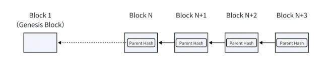

# Hành trình học web3
## Tầm quan trọng của web3
- Web3 nhấn mạnh tính phi tập trung và user có quyền sở hữu dữ liệu thực sự đối với nội dung họ tạo ra
- PoW và PoS
- Muốn thay đổi bản ghi của một số cái phân tán thì cần 51% thành viên đồng ý
- Blockchain Etherum:
  + Blockchain - là một chuỗi các `block` được kết nối cụ thể với nhau tạo thành 1 chuỗi, mỗi khối chứa giá trị `hash` của block trước đó, gọi là Parent hash. Mỗi khối được kết nối với khối trước nó, tạo thành một chuỗi liên tục từ `Genesis Block` đến khối gần nhất. 

  + Block:
    - parentHash: Ghi lại hash của khối trước đó
    - timestamp: Ghi lại time khối được tạo
    - nonce: Được sử dụng trong quá trình khai thác PoW
    - difficulty: Độ khó khai thác
    - coinBase: Xác định the miner’s account address
    - stateRoot: Giá trị hash gốc của the blockchain’s state tree
    - receiptRoot: Giá trị hash gốc của the receipt tree (biên nhận)
    - transactionRoot:Giá trị hash gốc của the transaction tree (giao dịch)
    

### Move
- 

