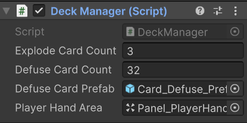

# Làm việc ở GameSceneFake

- `Deck` là một image có chứa component:
    + `Button` -> khi onclick vào Deck sẽ gọi `DeckManager.DrawCard()` (1)
    + `Deck Manager`

- `Panel_PlayerHandArea` có chứa componnent:
    + `Horizontal Layout Group` (để chứa bài)
    + `Dynamic Hand Spacing` (có tác dụng là khi bốc nhiều bài thì các lá bài đè lên nhau tránh bài tràn khỏi Panel)

- `(1)` Cách hoạt động của hàm `DeckManager.DrawCard()` là khi bốc trúng lá bom thì gọi hàm Warning() còn không thì gọi hàm AddToHand().
    + Hàm `Warning()` hiện tại chưa code chỉ có tính năng in ra thông báo chứ chưa dừng game
    + Hàm `AddToHand` sẽ lấy Card_Defuse_Prefab nằm trong Assets/Prefab/LinhTinh gán vô Panel_PlayerHandArea  
    